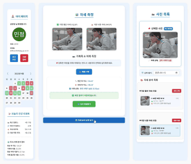

# 🧍‍♂️ 거북목 & 어깨 기울기 측정 프로그램

이 프로젝트의 README는 다음 언어로 제공됩니다.  
언어를 선택하세요:

🇯🇵 [日本語版을読む](./README.md)  
🇰🇷 한국어 (현재 표시 중)

---

# 🧍‍♂️ 거북목 & 어깨 기울기 실시간 측정 웹앱

> **웹캠 + Pose Detection + Vue.js + Node.js**  
> 실시간 자세 분석을 통해 거북목과 어깨 비대칭을 측정하는 프로젝트  
> 📷 웹캠만 켜면 → 📐 각도 자동 측정 → 📝 분석 요약 제공

---

## 📌 프로젝트 개요

현대인들의 잘못된 자세 문제(거북목, 어깨 비대칭)를 개선하기 위해  
**웹캠 기반의 실시간 자세 측정 시스템**을 개발했습니다.

- 웹캠으로 상반신 촬영  
- **딥러닝 기반 Pose Detection**으로 목/어깨 각도 자동 계산  
- 측정된 각도를 분석하여 **자세 요약 카드**와 피드백 제공

---

## 🎥 시연 영상

> 📸 실시간 측정과 결과 화면 예시

### 📍 측정 중 화면  

### 📍 측정 결과 화면  

- 위: 웹캠을 켜고 실시간으로 자세를 측정하는 장면  
- 아래: 측정 완료 후 사용자에게 제공되는 분석 결과 화면

---

## 🛠️ 사용 기술

| 구분 | 기술 |
|------|------|
| **Frontend** | Vue.js, Chart.js |
| **Backend** | Node.js, Express, MySQL |
| **AI 모델** | Mediapipe Pose |
| **기타** | Webcam Streaming, REST API, Donut Chart 시각화 등 |

---

## ✨ 주요 기능 요약

- 실시간 웹캠 자세 측정  
- 목 각도 / 어깨 비대칭 자동 추출  
- 가장 바른 자세 / 나쁜 자세 이미지 저장  
- 분석 요약 카드 및 도넛 차트 시각화  
- 마이페이지에서 히스토리 확인 가능
